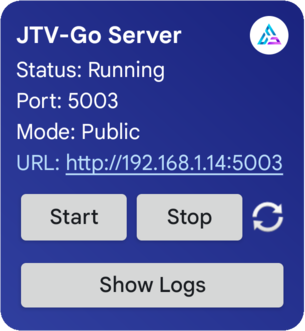
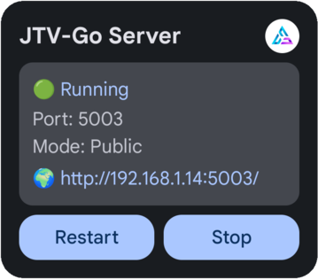
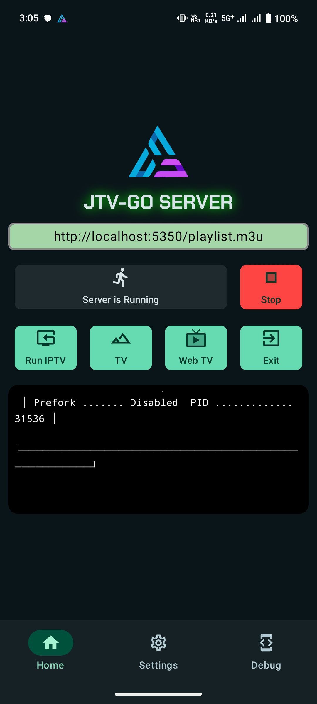
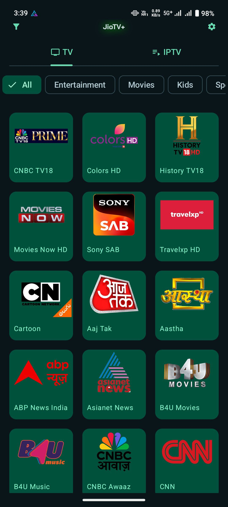

<h1 align="center">
   
  
   
  📺 JioTV+
   
</h1>

Access JioTV Go - streamlined for quick access and optimal performance!

  
  
  

<table>
  <tr>
    <td></td>
    <td></td>
  </tr>
</table>

<table>
  <tr>
    <td></td>
    <td></td>
  </tr>
</table>

---

### ✨ Features

**JioTV+** is a lightweight Android app that runs the JioTV Go server and provides a TV-friendly UI.

- ⚡️ **Smaller, Faster, and Lighter**: At around 5 MB, JTV-GO is optimized for minimal storage use, with no unnecessary clutter, making it faster and more efficient.
- 📱 **One APK for All Devices**: Designed to work seamlessly across devices from Android 5 to the latest version, so there's no need for multiple versions.
- 🛠 **No Dependency Hassles**: JTV-GO Server is a standalone, native app. No extra installations needed.
- 🚀 **Enhanced Performance**: Built for efficient resource usage, JTV-GO provides a smooth, stable streaming experience.
- 🔄 **Streamlined Design**: Focused exclusively on TV streaming, JTV-GO has a simple and user-friendly interface that’s easy to navigate.

JTV-GO Server keeps the focus on TV streaming with extra optimizations for a better, faster experience.

---

### 📥 Installation

1. **Download the APK**: Grab the latest release
   <!--  from the [releases page](https://github.com/atanuroy22/jiotv_go_app/releases/latest). -->

   

2. **Install the APK**:

   - Enable installation from unknown sources in your TV's settings.
   - Use a file manager to locate and install the downloaded APK.

3. **Grant Permissions**: Ensure JTV-GO Server has the necessary permissions for storage and network access to function properly. For best performance, confirm all permissions during the initial setup.

---

### 🚀 Usage

1. **Setting Up for the First Time**:

   - Upon the first launch, JTV-GO will initialize the necessary environment and download the required server binaries.

2. **Accessing TV Channels**:

   - Navigate to the **WEB TV** menu to explore available channels.
   - Select a channel to start streaming instantly from the JTV-GO server.

3. **Using an IPTV Player**:

   - To access channels via an IPTV player, add the IPTV playlist URL in your preferred IPTV player app.
   - Format of URL for JTV-GO: `[http://<IP>:<port>/playlist.m3u]`
   - Open the IPTV player and go to the section for adding playlists.
   - Input the JTV-GO IPTV playlist URL and save it.
   - Select the playlist to browse and play available channels.

4. **Troubleshooting**:
   - If you experience issues with channel playback, ensure the server is running and the network connection is stable.
   - Check for any firewall or security settings blocking the server’s port.

---

### 🙏 Thanks

- **rabilrbl** — original developer
- All contributors who helped improve this project
<!-- 
build

./gradlew.bat :app:assembleDebug :app:lintDebug :app:testDebugUnitTest
.\gradlew.bat :app:assembleRelease -->
