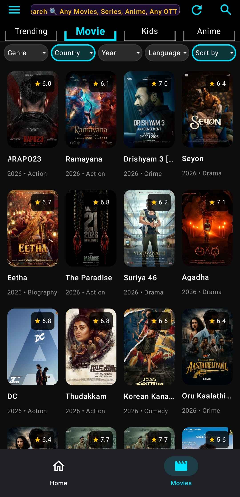
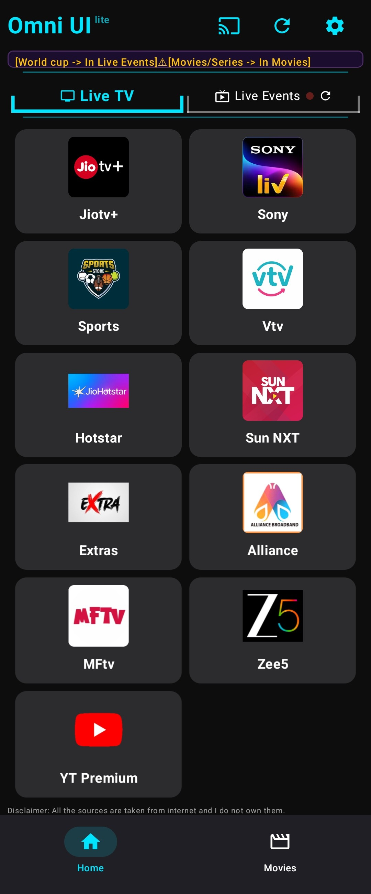
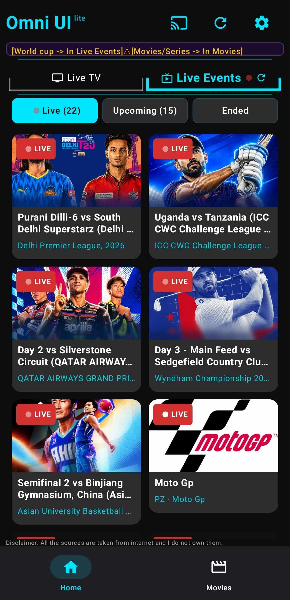

# Omni TV
<h1 align="center">
   
  
   
  📺 Omni TV
   
</h1>

Enjoy streaming and optimal performance!

  
  
  

<table>
  <tr>
    <td></td>
    <td></td>
    <td></td>
  </tr>
</table>

---
---

### 📥 Installation

1. **Download the APK**: Grab the latest release
   <!--  from the [releases page](https://github.com/atanuroy22/jiotv_go_app/releases/latest). -->

   

     
      
     
       <!-- 
        -->
       TV & Mobile Friendly
     
   

2. **Pick your edition** — each release ships two APKs:

   | APK | Contains | Notes |
   |---|---|---|
   | `OmniTV-Lite-<version>.apk` | Omni UI + Movies | Smaller and faster. Installs cleanly on the latest Android. **Recommended for most users.** |
   | `OmniTV-universal-<version>.apk` | Everything, incl. Free Jio, Chromecast | Shows a "built for an older version of Android". |

---
### ⚖️ Disclaimer

This project is provided strictly for **educational, research, and personal
learning purposes only**. It does **not** host, store, or distribute any audio,
video, or copyrighted media. All streams, links, and data it references are
**publicly and freely available elsewhere on the internet** — this project only
demonstrates how such publicly available sources can be accessed.

It is **not affiliated with, endorsed by, or sponsored by** any content provider,
broadcaster, or trademark holder. All trademarks and content belong to their
respective owners. The author does **not** encourage or condone any unauthorized
or illegal use; users are solely responsible for complying with all applicable
laws and any third-party terms of service. The software is provided "AS IS",
without warranty of any kind, and the author accepts no liability for misuse.

---
